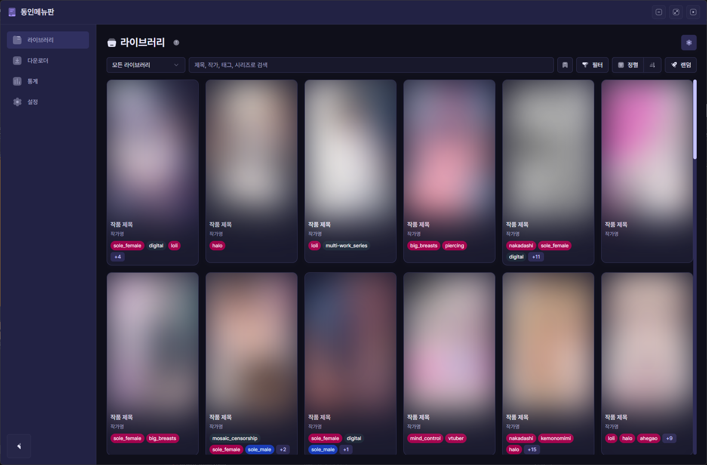

# 동인메뉴판



[](https://github.com/qqoro/doujin-menu/releases/latest)
[](https://github.com/qqoro/doujin-menu/releases/latest)

**만화책 라이브러리 관리 및 뷰어 데스크톱 애플리케이션. 대용량 만화 파일 컬렉션을 효율적으로 관리하고, 사용자 친화적인 뷰잉 경험을 제공합니다.**

## 🚀 설치 방법

1. [릴리즈 페이지](https://github.com/qqoro/doujin-menu/releases/latest)에서 최신 인스톨러(`yasig-menu-setup-x.x.x.exe`)또는 포터블 버전을 다운로드합니다.
2. 다운로드한 파일을 실행합니다.

## ✨ 주요 기능

- **라이브러리 관리**
  - 폴더 및 ZIP/CBZ 파일 형식 지원
    - 중첩 폴더 처리 지원
  - [Hitomi-Downloader](https://github.com/KurtBestor/Hitomi-Downloader)의 `info.txt` 파일에서 메타데이터 자동 파싱
  - 제목, 작가, 태그, 시리즈, 읽음 상태, 폴더 경로 등 다양한 검색 및 필터링 옵션
  - 목록 그리드 레이지 로딩
- **시리즈 관리**
  - AI 기반 자동 시리즈 감지 (제목 유사도, 작가/시리즈 메타데이터 분석)
  - 시리즈별 책 그룹화 및 순서 관리
  - 수동 시리즈 생성/편집/병합/분할 지원
  - 시리즈 내 자동 네비게이션 (이전/다음 책)
  - 다운로드 완료 후 자동 시리즈 감지
- **검색 프리셋**
  - 자주 사용하는 검색어 조합을 저장하고 클릭 한 번으로 적용
- **뷰어**
  - 세 가지 읽기 방향 지원: 좌→우, 우→좌, 스크롤
  - 더블 페이지 보기 및 자동 맞춤 확대
  - 열람 기록, 북마크, 마지막 페이지 자동 복원
  - 마지막 페이지에서 자동 다음 책 넘김 (시리즈 지원)
  - 다양한 단축키 지원
- **다운로더**
  - 원하는 작품을 검색하고 지정한 폴더에 다운로드
  - 다운로드 큐 시스템 (순차 처리, 일시정지/재개/재시도)
  - 앱 재시작 시 미완료 다운로드 자동 복구
  - 진행률 및 속도 실시간 표시
  - CBZ 형식 자동 압축 지원
- **썸네일 및 이미지 처리**
  - 책의 첫 페이지 파일에서 썸네일 자동 추출
  - 비동기 썸네일 생성 (워커 스레드)
- **다크모드 지원**
- **설정 및 유지보수**
  - 다중 라이브러리 폴더 지정
  - 데이터베이스 백업/복원 (.db 파일)
  - 썸네일 재생성 및 잘못된 항목 정리
  - 자동 업데이트 지원

## 🛠️ 기술 스택

- **Desktop Shell**: Electron 38+
- **UI Framework**: Vue 3 (Composition API)
- **Design System**: Tailwind CSS 4 + shadcn-vue (Reka UI)
- **Data Fetching**: Tanstack Vue Query
- **Database**: SQLite 3 (better-sqlite3, Knex 쿼리 빌더)
- **Archive Handling**: yauzl (읽기), archiver (쓰기/CBZ 생성)
- **Image Processing**: sharp (워커 스레드)
- **Build Tool**: Vite + electron-builder
- **State Management**: Pinia
- **Routing**: Vue Router (hash mode)
- **Downloader**: node-hitomi
- **Icons**: Iconify Vue (solar duotone)

## 🚀 시작하기 (개발 환경)

프로젝트를 로컬에서 개발하고 실행하기 위한 단계입니다.

### 전제 조건

- Node.js (v18 이상 권장)
- pnpm (패키지 매니저)

### 설치

```bash
pnpm install
```

### 애플리케이션 실행

개발 모드로 애플리케이션을 실행합니다. Electron과 Vite 개발 서버가 동시에 시작됩니다.

```bash
pnpm dev
```

### 빌드

배포 가능한 애플리케이션을 빌드합니다.

```bash
# Windows 인스톨러 (NSIS)
pnpm build

# Windows 포터블 버전
pnpm build:port
```

### 코드 검사

ESLint 및 Prettier를 사용하여 코드 스타일을 검사합니다.

```bash
pnpm lint          # 코드 검사
pnpm lint:fix      # 자동 수정
```

### 코드 포맷팅

Prettier를 사용하여 코드 포맷을 자동으로 수정합니다.

```bash
pnpm format
```

## 📄 라이선스

이 프로젝트는 MIT 라이선스에 따라 배포됩니다. 자세한 내용은 [LICENSE](LICENSE) 파일을 참조하십시오.
